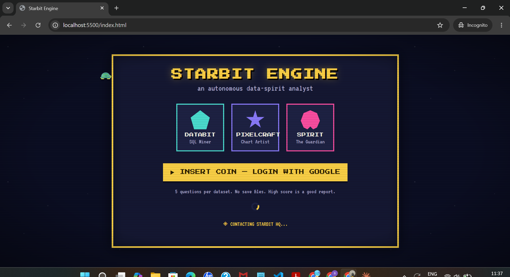
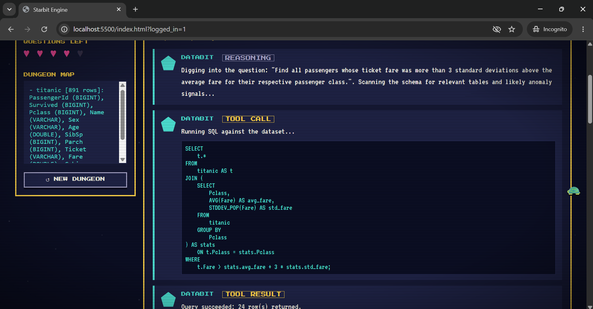
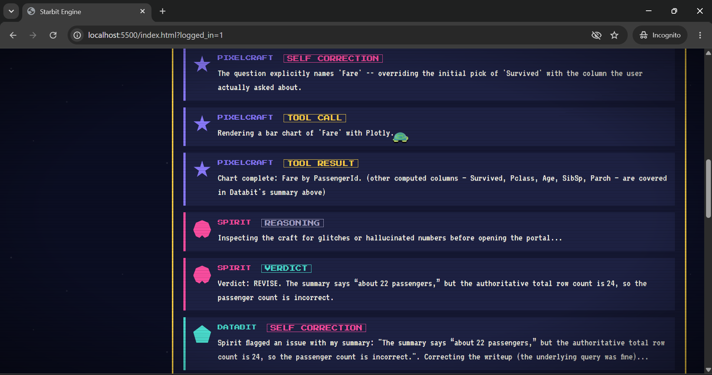
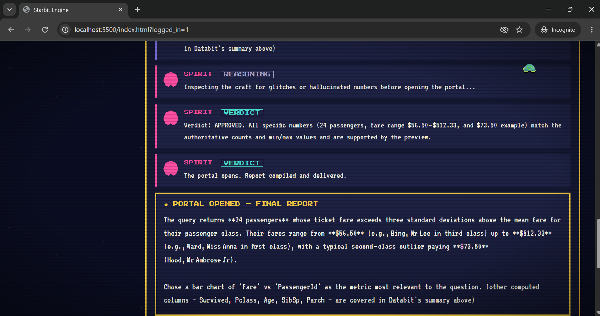
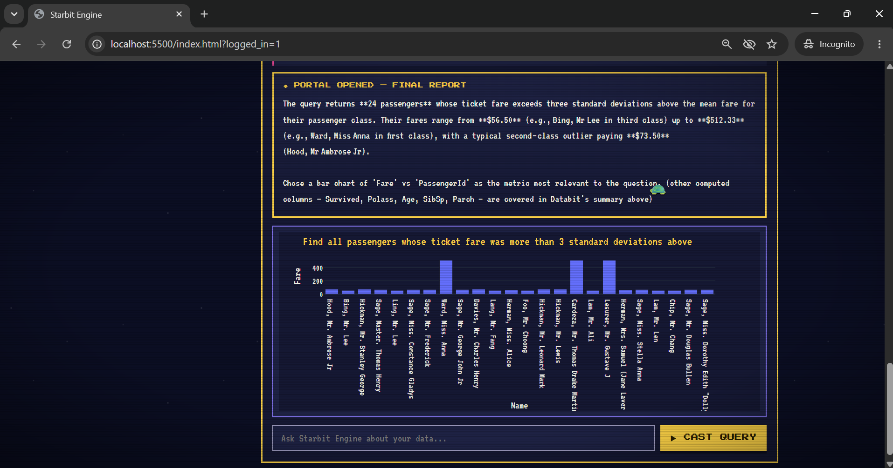

# ⭐ Starbit Engine

**An autonomous multi-agent data analyst with a self-correcting evaluation harness.**

Upload a dataset, ask a question in plain English, and watch three specialized agents — a SQL agent, a visualization agent, and a critic agent — reason, act, catch each other's mistakes, and correct them, live, in a retro-arcade console.

```
   ┌──────────┐   SQL / self-correction loop     ┌────────────┐
   │  DATABIT  │◄─────────────────────────────►  │            │
   │ SQL Agent │                                   │            │
   └─────┬─────┘   on success                      │  LangGraph │
         │────────────────────────────────►        │   State    │
         │                                          │            │
   ┌─────▼──────┐                                  │            │
   │ PIXELCRAFT │  chart                            │            │
   │  Viz Agent │─────────────────────────────►     │            │
   └────────────┘                                   │            │
                                                      │            │
   ┌────────────┐  revise (loops back                │            │
   │   SPIRIT    │◄─ to Databit) ────────────────────┤            │
   │Eval Harness │  approved                          │            │
   └─────┬──────┘─────────────────────────────►      └─────┬──────┘
         │                                                    │
         ▼                                                    ▼
     verdict                                              REPORTER
                                                    (compiles final
                                                      report + chart)
```

---

## Screenshots

| | |
|---|---|
|  |  |
|  |  |
|  | |

---

## Why this project exists

Most agent demos show the happy path once and stop. This one is built — and documented — around the opposite question: **what happens when it doesn't work, and does the system handle that honestly?**

Every architectural decision below was shaped by a real failure found while testing, not designed in the abstract. The [debugging log](#debugging-log--real-failures-found-and-fixed) is the actual differentiator here, not the chart colors.

---

## Architecture

| Agent | Role | What it actually does |
|---|---|---|
| **Databit** | SQL Agent | Writes and executes DuckDB SQL against the uploaded dataset. Retries its own syntax errors (bounded, max 3 attempts) by reading the error message and rewriting the query. |
| **Pixelcraft** | Visualization Agent | Picks a chart type and the single most relevant metric to plot — deliberately *not* every numeric column, since charting unrelated scales together (a count, a dollar amount, a percentage) produces a meaningless graph. |
| **Spirit** | Evaluation Harness | Fact-checks Databit's written summary against the actual query result before anything ships. Catches hallucinated numbers, unsupported claims, and vague non-answers. Bounded revision loop (max 2 rounds) — if it still can't get a clean pass, the report ships honestly labeled `(unreviewed)` rather than lying about its own confidence. |

**The graph is explicit, not implicit.** Control flow — retries, revisions, termination — is expressed as LangGraph edges with hard bounds, not buried in nested `if/else` inside one giant function. Every loop in this system has a maximum iteration count; nothing can spin forever.

---

## Engineering highlights

**Deterministic backstops under LLM judgment calls, not just better prompts.**
When prompt engineering alone proved unreliable (an LLM classifier consistently mispicked a familiar column over the one the question actually named), the fix wasn't a stronger prompt — it was a deterministic keyword-match override that runs *before* the LLM call, checked against real test cases. When Spirit's stricter fact-checking pushed Databit toward stripping all numbers from a summary to avoid an unverifiable claim, the fix was a structural check (does the response contain a digit?) with a guaranteed, code-generated fallback if the LLM fails that check twice — not a third prompt asking it to try harder.

**Authoritative metadata beats truncated previews.**
Spirit only ever sees a length-capped preview of query results, for cost and latency reasons — but it needs to fact-check claims about the *full* result (row counts, min/max values). Rather than let it guess from a partial view, Databit computes true aggregates from the untruncated DataFrame and passes them alongside the preview as trusted ground truth.

**A build fingerprint, because "did my fix actually deploy" is a real production question.**
`/health` returns a hash of every file in `agents/`, computed at process startup. This turned "is the running server actually serving my latest change" from a recurring debugging session into a five-second check — a small tool built specifically because it kept being needed.

---

## Tech stack

- **Orchestration:** LangGraph (explicit state machine, typed `TypedDict` state, conditional edges)
- **LLM:** Groq (`openai/gpt-oss-120b` for SQL/fact-checking, `openai/gpt-oss-20b` for cheap classification calls) — chosen for a genuinely free tier, no credit card required
- **Backend:** FastAPI, DuckDB (in-memory SQL engine, queries CSV/SQLite/DuckDB files directly), Pydantic
- **Auth:** Google OAuth 2.0 via Authlib, with a `MOCK_AUTH` dev-mode toggle for local testing without live credentials
- **Frontend:** Vanilla HTML/CSS/JS, Plotly.js for charts — retro pixel/arcade aesthetic, animated SVG neuron/data-flow diagram synced live to the actual agent trace
- **Sessions:** Stateless, signed cookies (survive backend restarts) rather than a server-side dict (which doesn't)

---

## Setup

### Prerequisites
- Python 3.11+
- A free Groq API key from [console.groq.com](https://console.groq.com/keys)

### Backend
```bash
cd backend
python -m venv venv
source venv/bin/activate        # Windows: venv\Scripts\Activate.ps1
pip install --upgrade pip
pip install -r requirements.txt
cp .env.example .env
```
Edit `.env`: set `GROQ_API_KEY`, generate a `SESSION_SECRET_KEY` with `python -c "import secrets; print(secrets.token_hex(32))"`, leave `MOCK_AUTH=true` for local dev (skips real Google OAuth).

```bash
uvicorn main:app --reload --port 8000
```

### Frontend
```bash
cd frontend
python -m http.server 5500
```
Open **http://localhost:5500**.

### Try it
Upload `sample_data/company.db` (included — synthetic revenue/pricing data with a deliberate anomaly), then ask: *"Why did revenue drop in April?"*

Full real-OAuth setup (Google Cloud Console steps) is in `backend/.env.example`.

---

## Known limitations

- **Databit's self-correction has a deterministic fallback, but the SQL itself is still LLM-generated** — no text-to-SQL system, including production ones, guarantees perfect query logic on genuinely ambiguous or highly compound questions. Spirit catches when the *summary* misrepresents the *query result*; it does not yet independently verify that the SQL's logic matches the question's full semantic intent.
- **The uploaded dataset lives in an in-memory DuckDB connection** — it survives normal operation but not a backend process restart. This is handled gracefully (a clear "please re-upload" message, login and question quota unaffected) rather than crashing, but it is a real constraint, not a false one.
- **Single-process, no persistence** — no conversation history is stored anywhere by design (stated on the login screen: "no save files"). A production version would add a database-backed session store and audit log.

---

## Debugging log — real failures found and fixed

Every entry below was a genuine bug caught during testing, with the fix verified against the actual failing case — not assumed correct.

| # | Failure | Root cause | Fix |
|---|---|---|---|
| 1 | Chart always plotted `Survived` regardless of the question | Chart-choice prompt had no strong signal for column relevance | Deterministic keyword-match override: a column name literally present in the question wins, checked in code before the LLM call |
| 2 | Override then over-fired on composite metrics (picked a raw ingredient like `Fare` over a computed `privilege_score`) | No distinction between a composite score and its own sub-components | Excludes any "score" column whose name-prefix is already explicitly named in the question, isolating the true composite |
| 3 | Final report cut off mid-sentence | Stricter "always be concrete" instruction pushed the summarizer to enumerate every row in a large result, exceeding the token cap | Explicit cap on row enumeration (~5 rows max, cite range + examples beyond that) plus a raised token ceiling as backstop |
| 4 | SQL used `LIMIT 10` on a "top 3" question | No explicit instruction tying `LIMIT` to counts named in the question | Added an explicit rule: any count named in the question must be reflected exactly in `LIMIT` |
| 5 | Chart plotted a column that was identical across every row (e.g. `passenger_count`, always 3 vs 3 by construction) | Column choice considered names, not actual data variance | Data-driven filter: any column with zero variance across the result is excluded from candidates before the LLM ever sees it |
| 6 | Chart x-axis used `PassengerId`, spacing bars by numeric value and leaving huge gaps | X-axis defaulted to the query's first column with no regard for whether it was a meaningful label; bar charts weren't forced to categorical spacing | Prefers an actual label/name column over an ID-like column; forces categorical (evenly-spaced) x-axis on all bar charts regardless |
| 7 | Spirit repeatedly rejected true row-count and min/max claims it couldn't verify from a length-truncated preview, eventually causing the summary to collapse to empty | Spirit only had access to a capped preview, not the true full-result aggregates | Databit computes true row count and per-column min/max from the untruncated result and passes them to Spirit as authoritative metadata |
| 8 | Even with the above, an LLM correction could still occasionally strip all numbers to avoid an unverifiable claim | Prompt-only guardrails ("always include numbers") are a strong suggestion, not a hard guarantee | Structural check: response must contain a digit; if two attempts both fail this, fall back to a deterministic, code-generated summary built from the already-verified stats — no LLM call in the final safety net |

---

## License

MIT — see [LICENSE](LICENSE).
